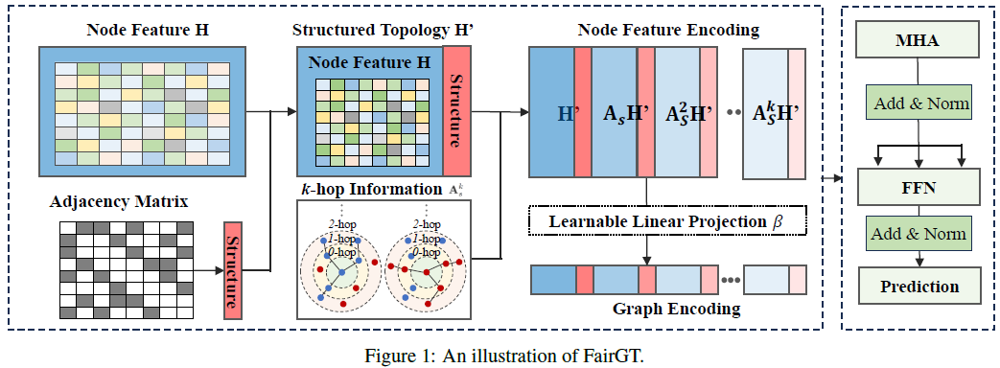

# FairGT: A Fairness-aware Graph Transformer in Pytorch

PyTorch implementation of FairGT [1].



## Usage

#### train fairgt

```shell
python train_fairgt.py --gpuid 0 --dataset "nba" --hops 3 --pe_dim 7 --hidden_dim 256 --nhead 2 --nlayer 2

python train_fairgt.py --gpuid 0 --dataset "german" --hops 1 --pe_dim 7 --hidden_dim 128 --nhead 1 --nlayer 1

python train_fairgt.py --gpuid 0 --dataset "income" --hops 1 --pe_dim 2 --hidden_dim 16 --nhead 1 --nlayer 1

python train_fairgt.py --gpuid 0 --dataset "bail" --hops 3 --pe_dim 3 --hidden_dim 128 --nhead 2 --nlayer 2

python train_fairgt.py --gpuid 0 --dataset "credit" --hops 2 --pe_dim 8 --hidden_dim 64 --nhead 1 --nlayer 1
```


## References

[1] [ Renqiang Luo, Huafei Huang, Shuo Yu, Xiuzhen Zhang and Feng Xia, "FairGT: A Fairness-aware Graph Transformer," *International Joint Conference on Artificial  Intelligence (IJCAI)*, 2024.](https://www.ijcai.org/proceedings/2024/50)


## Cite

Please cite our paper if you use this code in your own work:

```latex
@INPROCEEDINGS{fairgt2024luo,
  author={Luo, Renqiang and Huang, Huafei and Yu, Shuo and Zhang, Xiuzhen and Xia, Feng},
  booktitle={Proceedings of the International Joint Conference on Artificial  Intelligence (IJCAI)}, 
  title={FairGT: A Fairness-aware Graph Transformer}, 
  year={2024},
  publisher={ijcai.org},
}
```

